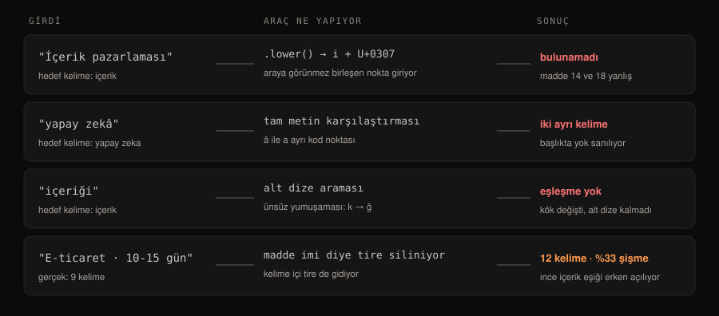

## Türkçe içerikte araçlar nerede yanılıyor?

Türkçe seo aracı ve içerik denetçilerinin çoğu **hata vermeden yanlış sonuç üretir.** Sorun kodlama (charset) değil — o bilinen ve çözülmüş bir konu. Asıl sorun, İngilizceye göre yazılmış metin mantığının bu dile olduğu gibi uygulanması.

Dört sınıf hata var ve dördü de sessizdir: **İ harfinin küçültülmesi, şapkalı harf, ünsüz yumuşaması ve kelime içi tireler.** Hiçbiri uyarı üretmez; sadece rapordaki sayı yanlış çıkar.

Bu yazıdaki örnekler teorik değil. Dördünü de kendi denetim aracımızda yaşadık, testle sabitledik; her birinin çıktısı aşağıda.



## İ harfi neden aramayı bozuyor?

Türkçe büyük `İ` harfinin küçültülmesi, çoğu dilde **iki karakterlik** bir sonuç üretir: `i` ve görünmez bir birleşen nokta (U+0307). Ekranda `i` görürsünüz, bellekte iki kod noktası vardır.

Sonuç şu:

```
"İçerik".lower()            → 'i̇çerik'   (kod noktaları: 0x69, 0x307)
"içerik" in "İçerik".lower() → False
```

Aracınız "hedef kelime başlıkta geçiyor mu" diye baktığında **geçmiyor** der. Oysa geçiyor. Bizim denetçimiz bu yüzden `İçerik Pazarlaması` başlığında `içerik pazarlaması` kelimesini bulamıyordu; 14 ve 18 numaralı kontroller yanlış uyarı veriyordu.

Bu davranış rastgele değil, standartta tanımlı: Unicode'un [SpecialCasing tablosu](https://www.unicode.org/Public/UCD/latest/ucd/SpecialCasing.txt) `İ` için dile duyarlı bir eşleme tanımlar, ama çoğu dilin varsayılan `lower()` çağrısı dilden bağımsız kuralı uygular.

Doğru davranış, karşılaştırmadan önce Türkçeye özgü bir katlama uygulamaktır: `İ → i` ve `I → ı` dönüşümünü elle yapıp sonra küçültmek.

## Şapkalı harf iki ayrı kelime mi?

Değil — ama bilgisayar için öyle. `â` ve `a` farklı kod noktalarıdır, dolayısıyla `zekâ` ile `zeka` tam metin karşılaştırmasında eşleşmez.

Türkçede ikisi de yaygın yazılır. Başlığınızda "Yapay Zekâ" yazıyorsa ve hedef kelimeniz "yapay zeka" ise, araç **başlıkta hedef kelime yok** der. Bu tam olarak bizim blog yazımızda oldu ve denetçinin kendi eksiğiydi: şapkalı harfleri katlamıyordu.

Çözüm basit ama unutulur: karşılaştırmadan önce `â î û` harflerini şapkasız karşılıklarına indir.

## Ekler yüzünden hedef kelime neden bulunamıyor?

Türkçe eklemeli bir dildir; kökün üstüne ek geldikçe kelime uzar. Bu tek başına sorun değil — asıl sorun **kökün kendisinin değişmesi**.

```
"içerik" in "içeriği"      → False
```

Sebep ek değil, **ünsüz yumuşaması**: `k` sesi iki ünlü arasında `ğ`ye dönüşür. Yani "içeriği" kelimesinde "içerik" dizisi hiç yoktur. Alt dize araması yapan her araç burada kör kalır.

Bu, çözümü en zor olanıdır. Tam bir kök bulucu (stemmer) yazmadan kapatılamaz. Pratik yaklaşım: hedef kelimeyi metinde arattığınızda **kelimenin tamamını değil, güvenli kökünü** aramak — ve aracın bunu yapıp yapmadığını bilmek. Ayrıntı için [anahtar kelime araştırması](#/terim/anahtar-kelime-arastirmasi) terimine bakabilirsiniz.

## Kelime sayımı neden şişiyor?

Markdown metinleri temizleyen araçlar madde imlerini (`- madde`) silmek için tire karakterini kaldırır. Kelime içindeki tireler de bu temizliğe takılır:

```
"E-ticaret sitelerinde 10-15 gun icinde SEO-dostu bir yapi kurulur."
gerçek kelime sayısı : 9
tire silinince       : 12   (%33 şişme)
```

SEO ve e-ticaret metinlerinde tireli terim yoğundur. Bu da şu anlama gelir: **600 kelimelik eşik gerçekte 480 kelimede aşılmış görünür.** Yani ince içeriği yakalamak için konulmuş kapı, tam da yakalaması gereken yerde açılır. [İnce içerik](#/terim/ince-icerik) kararının kelime sayısına değil sorunun kapanmasına bağlanması bu yüzden önemli.

## Okunabilirlik skorları Türkçe için geçerli mi?

Hayır. Flesch ve türevleri **İngilizce hece yapısına göre kalibre edilmiştir**; bu dilin hece ve kelime uzunluğu dağılımı farklıdır. Anlaşılır bir metin, yalnızca yapısı yüzünden düşük skor alabilir.

Bu yüzden ölçülebilir ve dile bağımlı olmayan **yapısal eşikler** kullanmak daha güvenilirdir:

| Gösterge | Pratik eşik | Neden dile bağımlı değil |
|---|---|---|
| Paragraf uzunluğu | ≤ 90 kelime | Ekranda kapladığı alan dilden bağımsız |
| Cümle ortalaması | ≤ 20 kelime | Yan cümlecik yükü her dilde birikir |
| Ritim kırılması | Her 250-300 kelimede tablo/liste | Tarama davranışı dilden bağımsız |
| Aynı kavrama tek ad | Zorunlu | Eşanlamlı dolaşımı her dilde yorar |

Ayrıntılı liste [okunabilirlik teriminde](#/terim/okunabilirlik) duruyor.

## Hangi ölçümler dile bağımlı, hangileri değil?

Aracınızın hangi raporuna güvenebileceğinizi bilmek, hangi hatayı yaptığını bilmek kadar önemli. Ölçümler ikiye ayrılır:

| Dile **bağımlı** — doğrulanmadan güvenilmez | Dile **bağımsız** — güvenilebilir |
|---|---|
| Hedef kelime eşleşmesi (kök, ek, şapka, İ) | Karakter uzunluğu (title, meta description) |
| Kelime sayısı (tire, kısaltma, birleşik kelime) | H1 adedi ve başlık hiyerarşisi |
| Okunabilirlik skoru | İç ve dış bağlantı sayısı |
| Kelime istifleme oranı | Bağlantıların HTTP durumu |
| Otomatik özet ve anahtar kelime çıkarımı | Tablo, liste, görsel varlığı |
| Duygu/ton analizi | Görsel alt metninin boş olup olmadığı |

Sağ sütun bir metni **saymakla** ilgilidir; sol sütun **anlamakla**. Sayan kontroller her dilde aynı çalışır, anlayanlar çalışmaz.

Araç seçerken sorulacak tek soru şu: *"Sol sütundaki ölçümleri Türkçe için nasıl yapıyorsunuz?"* Cevap "Unicode destekliyoruz" ise cevap değildir — Unicode desteği bir kodlama meselesidir, dil mantığı değil.

## Aracınızı 5 dakikada nasıl test edersiniz?

Dört küçük deney yeter. Aracınıza şu içerikleri verip raporun doğru çıkıp çıkmadığına bakın:

1. **İ testi:** Başlığı `İçerik Pazarlaması Nedir?` yapın, hedef kelimeyi `içerik pazarlaması` verin. Araç "başlıkta yok" diyorsa katlama yapmıyor.
2. **Şapka testi:** Başlıkta `Yapay Zekâ`, hedef kelime `yapay zeka`. Bulamıyorsa şapkayı indirmiyor.
3. **Kök testi:** Metinde yalnızca `içeriği` geçsin, hedef kelime `içerik` olsun. Bulamıyorsa alt dize araması yapıyor demektir — bu beklenen bir sınır, ama bilmeniz gerekir.
4. **Tire testi:** `E-ticaret 10-15 gün` yazıp kelime sayısına bakın. 3 kelime yerine 6 sayıyorsa tireleri siliyor.

Dördü de başarısızsa araç Türkçeyi ölçmüyor, İngilizce varsayımlarla tahmin ediyor demektir.

## Peki ne yapmalı?

- **Aracın dil davranışını test edin, tanıtımına güvenmeyin.** "Türkçe destekli" ifadesi arayüzün Türkçe olduğu anlamına gelebilir.
- **Yanlış uyarıyı sessizce kapatmayın.** Bizim denetçimizde şapka hatası, uyarıyı görmezden gelmek yerine kaynağını arayınca ortaya çıktı.
- **Her düzeltmeyi teste bağlayın.** Dört hatanın dördü de artık [kendi kontrol scriptimizde](#/skill) birer regresyon testi; sessizce geri gelemezler.
- **Kelime sayısını bulgu değil tetikleyici sayın.** Şişmiş bir sayı, yanlış bir karara dönüşmeden önce okunmalı.
- **Alt dize aramasının sınırını kabul edin.** Kök bulucu yoksa araç bazı eşleşmeleri kaçırır; bunu bilerek kullanmak, bilmeden güvenmekten iyidir.

Bu dört hata, [yapay zekâ içeriğinin sıralanmama sebeplerinden](#/blog/yapay-zeka-icerigi-neden-siralanmiyor) farklı bir katmanda: orada içerik yanlıştı, burada **ölçüm** yanlış. İkincisi daha tehlikelidir, çünkü yanlış ölçüm doğru içeriği bozmaya yönlendirir.

## Özet

- Türkçe içerik ölçen araçlar hata vermeden yanlış sonuç üretebilir; sorun charset değil, metin mantığıdır.
- `İ` harfinin küçültülmesi araya görünmez bir birleşen nokta (U+0307) koyar; hedef kelime bulunamaz.
- `â` ile `a` farklı kod noktalarıdır; "zekâ" ile "zeka" tam metin karşılaştırmasında eşleşmez.
- Ünsüz yumuşaması kökü değiştirir: "içeriği" kelimesinde "içerik" dizisi hiç yoktur.
- Kelime içi tirelerin silinmesi sayımı yaklaşık %33 şişirir; ince içerik eşiği erken açılır.
- Flesch türü okunabilirlik skorları Türkçe için kalibre edilmemiştir; yapısal eşikler kullanın.
- Aracınızı dört küçük deneyle 5 dakikada test edebilirsiniz.
