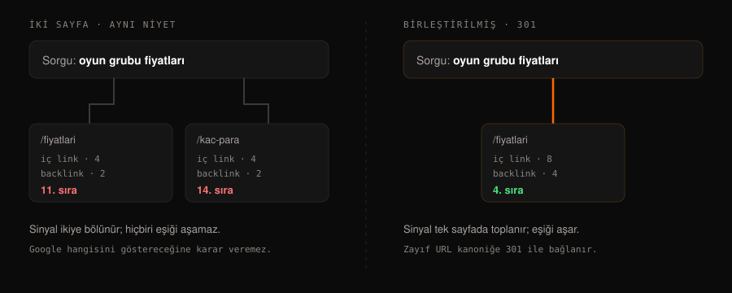
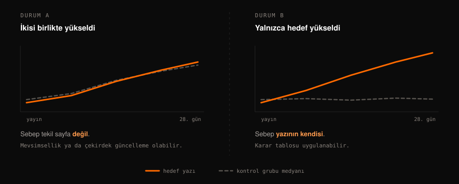

## Yapay zekâ içeriği neden sıralanmıyor?

Çoğu durumda sebep ceza değil. Yapay zeka içeriği için ayrı bir yaptırım yoktur; Google içeriğin nasıl üretildiğine değil, ne işe yaradığına bakar. Sıralanmayan içeriğin gerçek sebebi genellikle dört sessiz hatadan biridir: **kanibalizasyon, uydurma bilgi, bayat bilgi ve ölçüm yanılgısı.**

Dördü de sessizdir, çünkü hiçbiri hata mesajı vermez. Metin akıcıdır, dilbilgisi doğrudur, başlıklar yerindedir — ve içerik yine de bulunmaz.

Bu yazıdaki örnekler teorik değil: dördünü de bu sitenin kendisini kurarken yaşadık ve düzelttik.

## Kanibalizasyon nedir, nasıl anlaşılır?

Kanibalizasyon, aynı sitedeki iki sayfanın aynı arama niyetini hedefleyerek birbirinin sıralamasını zayıflatmasıdır. Yapay zekâ ile üretimde özellikle sık görülür, çünkü hızlı üretim yeni konu bulmaktan kolaydır: aynı konunun etrafında dönen beş yazı, tek güçlü yazıdan daha kötü sonuç verir.

Ayırt edici nokta şudur: sorun **aynı kelimeyi iki sayfada kullanmak değil**, aynı soruya iki sayfayla cevap vermektir. "Oyun grubu fiyatları" ve "oyun grubu kaç para" farklı kelimelerdir ama aynı sorudur.

**Nasıl teşhis edilir:** İki yazının H2 başlıklarını konu olarak eşleştirin ve oranı hesaplayın:

`örtüşme = eşleşen konu sayısı / kısa olan yazının H2 sayısı`

Sonuç %50 ve üzeriyse kanibalizasyon vardır. Bu yazıyı yayınlamadan önce aynı hesabı beş mevcut sayfaya karşı çalıştırdık; en yüksek örtüşme %0 çıktı. Ayrıntı için [kanibalizasyon teriminin tam açıklamasına](#/terim/kanibalizasyon) bakabilirsiniz.

## Uydurma bilgiyi nasıl yakalarsınız?

İkinci hata, dil modellerinin en bilinen zaafından gelir: bilmediğinde susmak yerine makul görüneni üretmek. Sonuç akıcı, tutarlı ve yanlıştır — üstelik doğru cevapla **aynı özgüvenle** yazılır.

Riskli alanlar bellidir: ölçüler, fiyatlar, standart numaraları, mevzuat tarihleri ve istatistikler. "Müşterilerimizin %90'ı memnun" cümlesi bir veri değil, bir cümle kalıbıdır.

**Nasıl teşhis edilir:** Metindeki her sayıyı işaretleyin ve her birinin yanına kaynağını yazın. Kaynağı gösterilemeyen sayı metinden çıkar. Bu kaba yöntem, [halüsinasyonun](#/terim/hallucination) en pahalı biçimini yakalar.

## SEO bilgisi ne kadar çabuk eskir?

Üçüncü hata en sinsisidir, çünkü içerik yayınlandığı gün doğrudur. SEO tarafı hızlı değişir ve dil modellerinin bilgisi belirli bir tarihte donar.

Somut örnekler:

| Ne değişti | Tarih | Hâlâ eski bilgiyi veren tavsiye |
|---|---|---|
| FAQ zengin sonuçları kaldırıldı | 7 Mayıs 2026 | "FAQ şeması ekle, SERP'te açılır kutu çıkar" |
| INP, FID'in yerini aldı | 12 Mart 2024 | "Core Web Vitals: LCP, FID, CLS" |
| `&num=100` parametresi kaldırıldı | 12 Eylül 2025 | "Gösterim düşüşünü önceki yılla karşılaştır" |
| Search Console yapay zekâ raporu geldi | 3 Haziran 2026 | "AI Overviews görünürlüğü ölçülemez" |

Dördü de bir yıl önce doğruydu. Bugün dördü de yanlış tavsiye üretiyor.

**Nasıl teşhis edilir:** Arama motoru davranışına dair her iddiaya bir tarih ve bir kaynak iliştirin. Kayıt üç aydan eskiyse yazmadan önce doğrulayın. Bu sitede tuttuğumuz [kaynak ve doğrulama kaydı](#/kaynaklar) tam olarak bu iş için var.

## Trafik arttı — sebebi gerçekten yazınız mı?

Dördüncü hata yazıda değil, yazıdan sonra yapılır. "Yazıyı yayınladık, trafik arttı" cümlesi tek başına hiçbir şey kanıtlamaz. Aynı dönemde sitenin tamamı arttıysa sebep içerik değil, mevsim ya da bir algoritma güncellemesi olabilir.

Google'ın kendi rehberi bu konuda nettir: çekirdek güncellemelerin etkisi değerlendirilirken karşılaştırma güncelleme öncesi hafta ile yapılır ve değerlendirme tek sayfa değil site geneli yürütülür.

**Nasıl teşhis edilir:** Yayın anında, aynı kategoriden ve o dönemde dokunmayacağınız 3-5 yazıyı seçip kayda geçirin. 28. günde hedef yazının değişimini bu grubun medyan değişimiyle birlikte okuyun. Grup da aynı yönde hareket ettiyse sebep tekil sayfa değildir. Yöntemin ayrıntısı [kontrol grubu teriminde](#/terim/kontrol-grubu).

## Bu dört hatayı biz de yaptık

Yazının başında "teorik değil" dedik; rakamlarla açalım. Bu siteyi kurarken dört bağımsız denetim çalıştırdık ve **11 doğrulanmış hata** çıktı. İkisi tam olarak yukarıdaki listedendi:

- **Bayat bilgi:** Yayınladığımız ilk sürüm, kaldırılmış bir zengin sonuç tipini öneriyordu. Bilgi yazıldığı gün doğruydu, iki hafta sonra yanlıştı.
- **Ölçüm yanılgısı:** İlk ölçüm planımız tek bir kontrol noktasından nedensel sonuç çıkarıyordu; kontrol grubu kavramı denetimden sonra eklendi.

Üçüncüsü daha ironikti: sitenin kendi `sitemap.xml` dosyası her derlemede o günün tarihini yazıyordu — yani içerik değişmediği hâlde tazelik iddia ediyordu. Kendi kuralımızı kendi sitemizde çiğnemişiz. Bunu bir insan değil, otomatik bir kontrol yakaladı.

Ders şu: bu hatalar dikkatsizlikten değil, **kontrol eksikliğinden** doğar. Dikkatli olmak ölçeklenmez; kapı ölçeklenir.

## Peki ne yapmalı?

Dört hatanın ortak noktası şudur: hiçbiri yazma aşamasında ortaya çıkmaz. İkisi yazmadan önce (kanibalizasyon, kaynak), biri yazarken (bayat bilgi), biri yayından sonra (ölçüm) yakalanır.

Bu yüzden çözüm daha iyi bir prompt değil, **kapıları olan bir süreçtir**:

1. Yazmadan önce örtüşme oranını hesapla, sayıyla yaz.
2. Her teknik bilginin kaynağını brief aşamasında belirle; kaynağı olmayan bilgiyi metne alma.
3. Zamana bağlı her iddiayı tarihiyle kaydet, üç ayda bir doğrula.
4. Yayın anında kontrol grubunu seç, sonradan değil.

Bu dört adımı elle yürütmek mümkündür. Biz tekrarlanabilir olması için [bir Claude skill'ine](#/skill) dönüştürdük; kapıların atlanamaz olması ve ölçülebilir maddelerin gerçekten sayılması bu yüzden önemliydi.

## Özet

- Yapay zekâ içeriğinin sıralanmamasının sebebi genellikle ceza değil, dört sessiz hatadır.
- Kanibalizasyon aynı kelimeden değil, aynı arama niyetinden doğar; ölçüsü H2 örtüşme oranıdır.
- Kaynağı gösterilemeyen sayı metinden çıkarılır; uydurma bilgi doğru cevapla aynı özgüvenle yazılır.
- SEO bilgisi hızla eskir: FAQ zengin sonuçları 7 Mayıs 2026'da kaldırıldı, INP 2024'te FID'in yerini aldı.
- Tek gözlemden nedensellik çıkarılmaz; kontrol grubu olmadan "işe yaradı" denemez.
- Dördü de yazma aşamasında değil, öncesinde ve sonrasında yakalanır.
